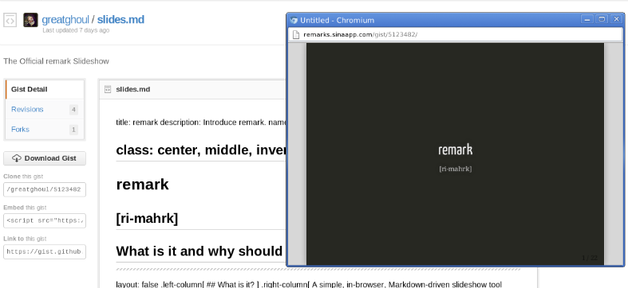

title: Introduce Remarks
name: inverse
layout: true
class: inverse

---
class: center middle

# Remarks
A simple remark slides player.

---
# What is remark

**Remark** is a simple, in-browser, markdown-driven slideshow tool targeted at people who know their way around HTML and CSS, featuring:

 * Markdown formatting, with smart extensions
 * Automatic syntax highlighting, with optional language hinting
 * Slide scaling, thus similar appearance on all devices / resolutions
 * Touch support for smart phones and pads, i.e. swipe to navigate slides
 * Check out this remark slideshow for a brief introduction.

Check out [this remark slideshow][^1] for a brief introduction.
Check out <https://github.com/gnab/remark> for more details.

[^1]: http://gnab.github.com/remark

---
# What is remarks

**Remarks** is a web application that making and playing remark slides online, featuring:

 * Play remark slides online from gist or github repositories
 * Bookmarklet to play slides easily
 * Bookmarklet to preview slides in a popup window.

---
# Remarks in gist

.footnote[[View sample][^1]]

[^1]: https://gist.github.com/greatghoul/5123482

---
# Remarks in repo

.footnote[[View sample][^1]]

[^1]: https://github.com/greatghoul/slides/tree/master/google-oauth2-and-analytics-data-api

---
# Set slides title

Remarks add some additional attributes in remark source:

    title: Introduce Remarks
    name: inverse
    layout: true
    class: inverse

in the first fieldset, `title` means the TITLE for slides.

---
# Set slides theme

Remarks will use **remark** official slide's stylesheet as default theme.

If you want to use your own, add theme config in meta attributes:

    title: Introduce Remarks
    theme: my-theme.css
    name: inverse
    layout: true
    class: inverse

You can also use full url path under other domain.

    theme: http://www.mydomain.com/static/mytheme.css

Or, use a common theme in other directory.

    theme: ../themes/my-theme.css

Theme filename must be end with `.css`

# Insert images host in github repo

Images beside slides source in repo subfolders can be embedded easily.

    /repo/path
      /slides-folder
        /slides.md
        /picture1.png
        /picture2.png

`slides.md`

    
    
---
name: last-page
template: inverse

## That's all folks (for now)!

Slideshow created using [remark](http://github.com/gnab/remark) and [remarks](http://remarks.sinaapp.com)
